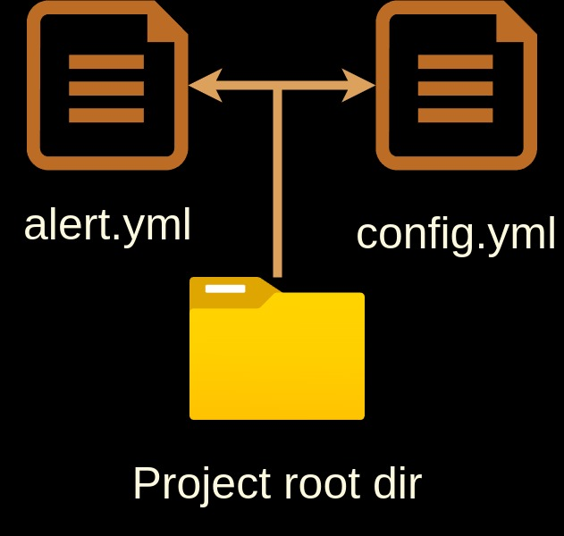
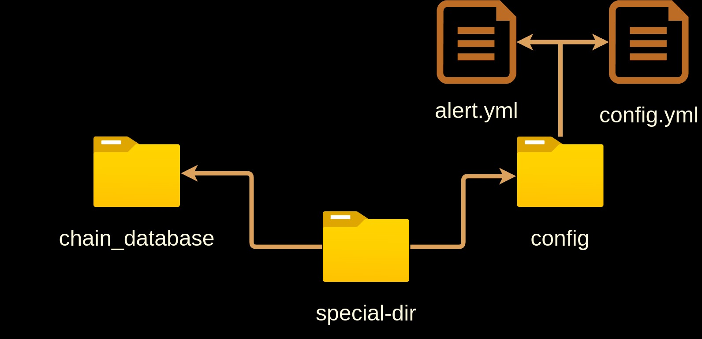

# TNOM - The Nibiru Oracle Monitor

The Nibiru Oracle Monitor is a monitoring tool for the Nibiru Oracle. It monitors if
the price feeder signed and wallet balances of the Nibiru Oracle, and alerts if 
any of these values are out of the expected range. TNOM is written in Python, and the
script can be compiled using Nuitka.

## Table of Contents

- [TNOM - The Nibiru Oracle Monitor](#tnom---the-nibiru-oracle-monitor)
- [How does the TNOM work?](#how-does-the-tnom-work)
- [Installation](#installation)
- [Requirements](#requirements)
- [Set up config](#set-up-config)
- [Run the script](#run-the-script)
- [Deploy the script](#deploy-the-script)


# How does the TNOM work?

TNOM is a monitoring tool. It collects data from Nibiru's REST APIs. The data is then
stored in the local SQLite database. It then checks if the data is within the expected
range. For example, if a certain amount of unsigned events from oracle happens, or if the
wallet balance is below a certain amount. If the data is not within the expected range,
TNOM alerts the user. Currently, it only supports Pagerduty and Telegram as the
means of sending alerts. It also supports health checks if the script or your server halts.

TNOM can be run directly using Python, or you can compile the code using Nuitka. 
The compiled version is somewhat faster but the con is that it might take a while
to build it. You can also download the compiled version.

# Installation

There are two ways to run TNOM:
1. Run the script directly
2. Build the script using Nuitka 
3. Or download the compiled version

The script was made with Poetry. You can use Poetry to install and run the script, 
use Python directly and run it like that, build the script using Nuitka, or download
the compiled version.

## Requirements

- Python 3.11 or higher
- All of the requirements in the requirements.txt file
- Poetry (optional)
- Python-dev (if you plan to compile the code)
- patchelf (only if you plan to compile the code)
- clang (only if you plan to compile the code)
- Docker (if you plan to deploy it using Docker)

The script was made using Python 3.11 it should work with any version >= 3.11, it has
been tested with 3.11 and 3.12.

Python Poetry was used to manage the dependencies. You can install it and use it to 
run the script, but it is not vital to run the script. It just simplifies the 
process. 
If you want to use Python Poetry, you can install it using the following command:

```bash
curl -sSL https://install.python-poetry.org | python3 -
```

If you plan to compile the code you will need to install patchelf, clang and some
essential tools. To install it you can use the following command:

For Debian-based systems (Debian, Ubuntu, etc.):
```bash
sudo apt update 
sudo apt install build-essential -y \
sudo apt install clang -y \
sudo apt install patchelf -y \
sudo apt install python-dev -y
```

For RHEL-based systems (Fedora, Rocky Linux, etc.):
```bash
sudo dnf update -y 
sudo dnf groupinstall "Development Tools" -y 
sudo dnf install clang -y 
sudo dnf install patchelf -y
sudo dnf install python-devel -y
```

## Set up config

For this script to work you need to have:
- A working directory, you can store it in the project root dir, or if you want
 to keep it separate you can create a directory just for the script and store it 
 there
- A config.yml file
- An alert.yml file

The config.yml file is a file that stores data such as valoper address, interval check
, APIs etc. Check the config_example.yml for an example. It should be an easy-to-edit
yml file.

```bash
cp config_example.yml config.yml
vim config.yml # or nano config.yml
```

The alert config is a yml file that stores the alert details. It requires to have
Pagerduty or Telegram details. You can also use both options if you desire. Another
feature is a dead man switch. This feature will send an alert if the script
does not run for a while. It is not required, but it is recommended.
Check the alert_example.yml for an example.

```bash
cp alert_example.yml alert.yml
vim alert.yml # or nano alert.yml
```

For alert to work you will need at least a Telegram bot and chat ID, and for Pagerduty 
you will need a routing key from Events API v2. The alerts have multiple severity
levels so you can set dynamic notifications. Setting up telegram, pagerduty and health
check is out of the scope of this guide. If there are many interested people, I might
create a guide on how to set them up. Some links to get you started:

- [PagerDuty](https://developer.pagerduty.com/docs/3d063fd4814a6-events-api-v2-overview)
- [Telegram](https://core.telegram.org/bots/tutorial)
- [HealthCheck](https://healthchecks.io/docs/)

### Recommended setup

This is just a recommendation you can set up your TNOM however you wish.
You can always set up everything in the project directory. And you can run the script/
binary from here.



Or you can create a dedicated directory and place everything there. This might make 
more sense if you plan to run it via Docker for example.



## How to run the script

The script can accept arguments that can be passed to by using the command line.
You can print help if you feel stuck.
```bash
poetry run python tnom/main.py -h # or python tnom/main.py --help 
# or build/tnom -h if you built executable binary
usage: main.py [-h] [--working-dir WORKING_DIR] [--config-path CONFIG_PATH]
 [--alert-path ALERT_PATH] [--version]

Monitoring system for price feeds and wallet balances

options:
  -h, --help            show this help message and exit
  --working-dir WORKING_DIR
                        The working directory for config files and database
                        Default: current working directory
  --config-path CONFIG_PATH
                        Path to the config YAML file
                        Default: /home/user/tnom/config.yml
  --alert-path ALERT_PATH
                        Path to the alert YAML file
                        Default: /home/user/tnom/alert.yml
  --version             show program's version number and exit
```

Flag working-dir is optional. It always takes as a default value the 
current directory from where the script is run. For example, if you run it while in 
/home/user/ that will be considered a working directory. It is recommended to use
for consistency because it will later generate a database in that directory. You can
select any directory but it might make sense to place it inside the project root 
directory.

The config-path is the path to config.yml file. It is optional but as a default, it
takes as a value /working-dir/config.yml. So you can place it inside of your work dir,
or if you want to keep it separate you can create a directory just for the config and
then when running use the argument --config-path /path/to/config.yml.

The alert-path is the path to alert.yml file. It is optional and it functions 
identically to the --config-path argument. So you either place it in the working dir or use argument --alert-path /path/to/alert.yml while running the script.

### Option 1 - Running the script directly

Run the script using Poetry:

```bash
git clone https://github.com/Cogwheel-Validator/tnom.git
cd tnom
poetry install
poetry run python tnom/main.py --working-dir /path/to/working/dir --config-path /path/to/config.yml --alert-path /path/to/alert.yml
```

Run the script using Python directly:

```bash
git clone https://github.com/Cogwheel-Validator/tnom.git
cd tnom
# create and activate a virtual environment
python -m venv v-tnom
source v-tnom/bin/activate
pip install -r requirements.txt
# run the script
python tnom/main.py --working-dir /path/to/working/dir --config-path /path/to/config.yml --alert-path /path/to/alert.yml
```

### Option 2 - Building the TNOM binary

Building the binary might take time. The code is compiled to C then it is compiled
into an executable binary. Depending on your system, it can up to 30 minutes to 
build.

For reference, it took about this much to build the binary on these machines: <br/>
2 vCPU: ~ 30 minutes <br/>
4 vCPU: ~ 15 minutes <br/>
8/16t CPU: ~ 5 minutes <br/>

It might take more/less time depending on your system. This should just give you some
idea of how long it can take.

Build using Poetry:

```bash
poetry install
poetry run nuitka_builder.py
```

Build using Python directly:

```bash
python -m venv v-tnom
source v-tnom/bin/activate
pip install -r requirements.txt
python nuitka_builder.py
```

The binary will be created in the build directory. You can from there run the binary:
```bash
./build/tnom --working-dir /path/to/working/dir --config-path /path/to/config.yml --alert-path /path/to/alert.yml
```

### Option 3 - Download the binary

Download the binary:

```bash
wget https://github.com/Cogwheel-Validator/tnom/releases/latest/download/tnom
# fix this later when you add the binary
chmod +x tnom
./tnom --working-dir /path/to/working/dir --config-path /path/to/config.yml --alert-path /path/to/alert.yml
```

The binary can be placed anywhere you want. For example, you can place it in /usr/bin/
or /usr/local/bin/whichever you prefer.

## Deployment options

Here you can find some basic setup to deploy it on the server and run it 24/7.
A word of advice, whatever program you use you need to have a kill signal in place.
At the moment the script has a problem to stop the script gracefully. Until this is
fixed use something similar to KillSignal=SIGINT.

### Systemd

This is assuming you run it from the project root directory and you have decided to 
also use it as a working dir and store .yml files. It assumes you run the script via 
Poetry. If you want to run with Python directly you can just change ExecStart 
to `(which python) tnom/main.py`. If you have working dir placed somewhere else or 
plan to place config and alert files somewhere else you can change the paths by  
adding arguments. For arguments check this [section](#how-to-run-the-script). 

```bash
sudo tee /etc/systemd/system/tnom.service > /dev/null <<EOF
[Unit]
Description=” TNOM Script Monitoring Service”
After=network-online.target
 
[Service]
User=$USER
ExecStart=$(which poetry) run python tnom/main.py
WorkingDirectory=$HOME/tnom
Restart=always 
RestartSec=5

KillMode=process
KillSignal=SIGINT
 
[Install]
WantedBy=multi-user.target
EOF
```

And this config assumes you run the TNOM via binary. It also assumes you have placed
the executable in the /usr/local/bin/ directory.

```bash
sudo tee /etc/systemd/system/tnom.service > /dev/null <<EOF
[Unit]
Description=”TNOM binary Monitoring Service”
After=network-online.target
 
[Service]
User=$USER
ExecStart=/usr/local/bin/tnom --working-dir /path/to/working/dir --config-path /path/to/config.yml --alert-path /path/to/alert.yml
WorkingDirectory=$HOME/tnom
Restart=always 
RestartSec=5

KillMode=process
KillSignal=SIGINT
 
[Install]
WantedBy=multi-user.target
EOF
```

Start and enable service
```bash
sudo systemctl daemon-reload
sudo systemctl enable tnom.service
sudo systemctl start tnom.service
```

### Docker (still needs testing)

From the Dockerfile create the image.

```bash
docker build -t tnom:v0.3.0 .
# Create config directories
mkdir -p ./config
mkdir -p ./chain_database

# Create config.yml and alert.yml in the config directory
touch ./config/config.yml ./config/alert.yml
# Keep in mind you need to edit each file to reflect your needs.
vim ./config/config.yml
vim ./config/alert.yml

# Run the Docker container with volume mounts
docker run -d \
 -v $(pwd)/config:/app/config \
  -v $(pwd)/chain_database:/app/chain_database \
 --name tnom \
  tnom:v0.3.0
```